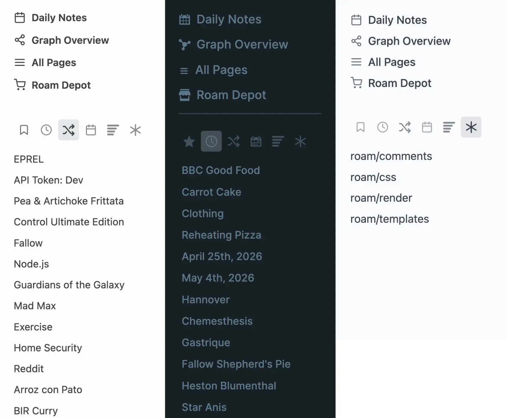

# Sidebar Reimagined

Sidebar Reimagined transforms the Shortcuts section of Roam's left sidebar into a multi-view navigation hub. Instead of a single list of starred pages, you get a row of icon tabs that let you quickly switch between different ways to explore your graph.

Sidebar Reimagined keeps your shortcuts exactly as they are, but adds new views alongside them — recent activity, random rediscovery, pages from this day in previous years, your most referenced pages, and quick access to system configuration.

## Tabs Available

### 1. Shortcuts
Your existing starred/shortcut pages, exactly as Roam provides them. This is the default view and is always available.

### 2. Recent
Shows the most recently edited pages in your graph. Useful for quickly jumping back to what you were just working on. You can configure how many pages to show (default: 10).

### 3. Random
Surfaces a random selection of pages from your graph. A great way to rediscover forgotten notes and make unexpected connections. Click the tab again to reshuffle. You can configure how many pages to show (default: 10) and whether to include daily note pages in the results.

### 4. On This Day
Shows pages connected to today's date in previous years — daily notes, pages you created, and pages you edited. A personal time capsule that surfaces what you were thinking about on this date in the past.

### 5. Most Mentions
Displays your most referenced pages, ranked by the number of times they're linked to across your graph. These are the hub pages of your knowledge base — the concepts and topics that connect everything together. You can configure how many pages to show (default: 10).

### 6. System
Quick access to your graph's configuration pages. Automatically finds all `roam/` pages (like `roam/css`, `roam/js`, `roam/templates`) and `queries/` pages (for Query Builder users). No need to search for them — they're always one click away.

## Settings

Each tab (except Shortcuts) can be individually shown or hidden from the sidebar via toggles in the extension settings. You can increase the count of items shown in any tab. All tabs are enabled by default.

## Theme Support

Sidebar Reimagined is designed to work with Roam's default theme and with [Roam Studio](https://github.com/rcvd/RoamStudio). The icons and page lists inherit their styling from the sidebar itself, so they should feel native regardless of which Roam Studio sub-theme you're using.
